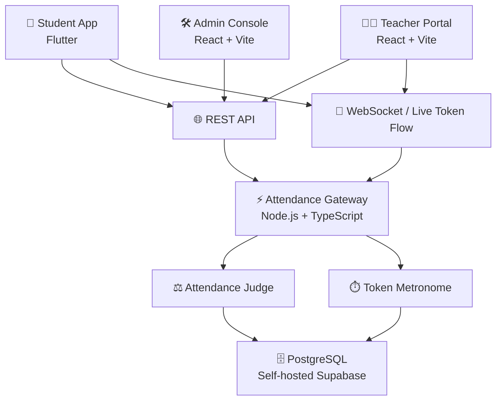
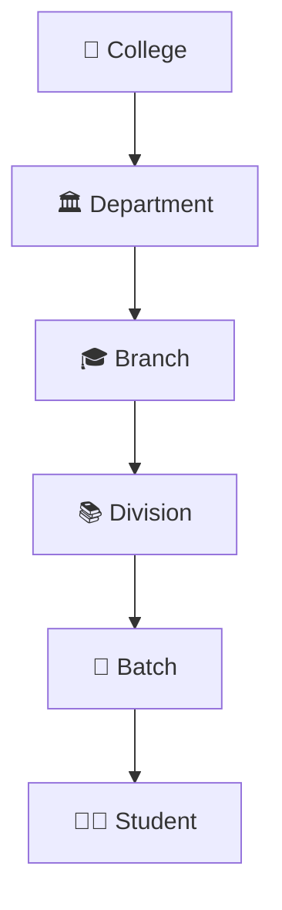
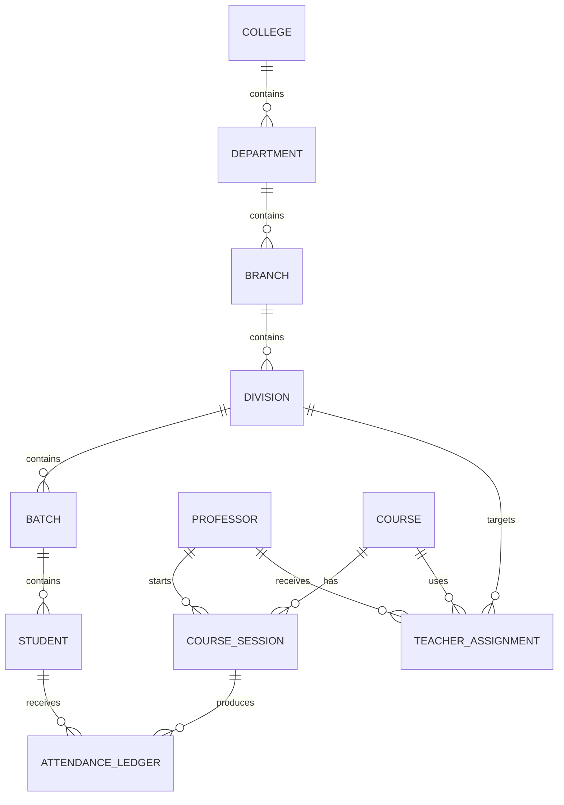
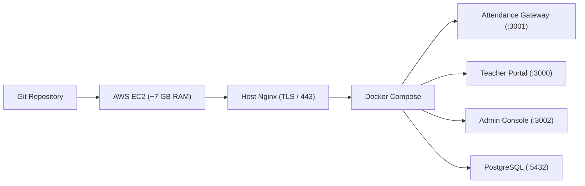

<div align="center">

# ⚡ AttendX

### Zero-Trust Cryptographic Attendance Gateway

**A self-hosted college attendance platform designed to verify classroom presence instead of blindly trusting an attendance request.**

<br/>

[](https://www.typescriptlang.org/)
[](https://nodejs.org/)
[](https://flutter.dev/)
[](https://www.postgresql.org/)
[](https://supabase.com/)
[](https://www.docker.com/)

</div>

---

## 📖 Overview

AttendX is a college software-group project built around a simple principle:

> **Attendance should be a verifiable event, not a trusted checkbox.**

The system combines a student mobile application, teacher portal, administrative console, a Node.js/TypeScript attendance gateway, and a self-hosted PostgreSQL/Supabase backend.

The original project architecture is designed to make a classroom attendance claim difficult to fake by combining multiple independent signals: device binding, biometric pre-checks, a short-lived rotating classroom token, and server-side cryptographic/time verification.

The production deployment runs on a dedicated **AWS EC2 instance (~7 GB memory)** backed by EBS gp3 SSD storage, retaining high durability and zero-trust verification guarantees.

---

## ✨ What AttendX Does

```text
Teacher starts a class
        │
        ▼
Gateway creates short-lived token
        │
        ▼
Live QR/token is shown in Teacher Portal
        │
        ▼
Student performs security pre-check
        │
        ├── Hardware/device check
        ├── Time synchronization check
        └── Biometric check
        │
        ▼
Student scans live QR
        │
        ▼
Student sends cryptographically signed claim
        │
        ▼
Attendance Gateway validates the request
        │
        ▼
Attendance is recorded in PostgreSQL
```

The documented baseline uses a rotating token every **3 seconds** and a server-side acceptance threshold of **≤250 ms** between the student's observed time and the token timing.

---

# 🧭 Table of Contents

- [Architecture](#-architecture)
- [Security Model](#-security-model)
- [Academic Hierarchy](#-academic-hierarchy)
- [Database](#-database)
- [Applications](#-applications)
- [API](#-api)
- [Repository Structure](#-repository-structure)
- [Local Development](#-local-development)
- [Database Migrations](#-database-migrations)
- [Docker & Homelab](#-docker--homelab)
- [Gitea Workflow](#-gitea-workflow)
- [Troubleshooting](#-troubleshooting)
- [Development Workflow](#-development-workflow)
- [Security Rules](#-security-rules)
- [Project Documentation](#-project-documentation)
- [Contributing](#-contributing)

---

# 🏗️ Architecture



### Major components

| Component | Responsibility |
|---|---|
| 📱 Student App | Attendance scanning, security pre-checks and attendance submission |
| 👨‍🏫 Teacher Portal | Course/session control and live classroom projector token display |
| 🛠️ Admin Console | Administrative and academic hierarchy management |
| ⚡ Backend | REST APIs, authentication, session handling and attendance verification |
| ⏱️ Metronome | Generates/rotates short-lived classroom tokens |
| ⚖️ Judge | Validates attendance claims |
| 🗄️ Supabase/PostgreSQL | Persistent application and attendance data |
| 🐳 Docker | Self-hosted service deployment |

---

# 🔐 Security Model

AttendX follows a **zero-trust client model**.

The server does not simply trust:

- the student's account
- the device
- the QR image
- the timestamp
- or the client application

Instead, multiple checks are combined.

## Gate 1 — Device / Hardware Binding

A student's account can be associated with a device identity/key.

This makes simple account sharing less useful because an attendance claim can be tied to the expected device.

## Gate 2 — Biometric Pre-check

The mobile application can require the device's local biometric authentication before allowing the attendance flow to continue.

The biometric itself remains a device-level authentication mechanism; the gateway does not need the student's raw biometric data.

## Gate 3 — Rotating Classroom Token

The teacher-facing session exposes a short-lived token/QR.

The documented baseline rotates the token every **3 seconds**.

A static screenshot therefore should not remain a valid attendance credential indefinitely.

## Gate 4 — Cryptographic Time Verification

The student client signs attendance information using the device-held secret/HMAC mechanism.

The gateway validates the cryptographic claim and compares the student's observed time against the session token timing.

The documented baseline accepts a difference of up to **250 ms**.

> These mechanisms improve resistance to common attendance abuse; they are not a claim that the system is impossible to attack.

---

# 🎓 Academic Hierarchy

The administrative system is being structured around a proper academic hierarchy rather than a flat division list.



## Why?

A college can contain multiple departments.

A department can contain multiple branches.

A branch can contain multiple divisions.

A division can contain multiple batches/students.

This allows the admin system to model the institution rather than encoding academic relationships into unrelated strings.

### Current institutional naming model

The project distinguishes **college**, **department**, and **branch**.

Examples include:

| Institution | Department | Branch |
|---|---|---|
| DEPSTAR | DCE | Computer Engineering |
| DEPSTAR | DCS | Computer Science |
| DEPSTAR | DIT | Information Technology |
| DEPSTAR | DAIML | AI & Machine Learning |
| CSPIT | — | CE |
| CSPIT | — | CS |
| CSPIT | — | IT |
| CSPIT | — | AIML |

### Roll-number convention

Examples discussed by the project:

```text
24DCE001
24CE001
25DCE152
```

The leading year can represent the admission/joining year:

```text
24 → 3rd-year cohort
25 → 2nd-year cohort
26 → 1st-year cohort
```

The exact automatic roll-number resolver should always follow the current backend implementation and database configuration rather than being inferred only from the string.

---

# 🗄️ Database

AttendX uses PostgreSQL through the self-hosted Supabase environment.

The database contains application identity, academic, attendance, session, security and audit information.

## Core entities



### Important database concepts

| Entity | Purpose |
|---|---|
| `students` | Student identity and attendance ownership |
| `professors` | Faculty identity |
| `courses` | Course definitions |
| `course_sessions` | Individual live attendance sessions |
| `attendance_ledger` | Attendance records |
| `teacher_assignments` | Teacher/course/division relationships |
| `divisions` | Academic division information |
| `admin_users` | Administrative users |
| `api_keys` | API key metadata |
| `active_tokens` | Live session token state |
| `crypto_challenges` | Cryptographic challenge state |
| `device_fingerprints` | Device association data |
| `biometric_templates` | Encrypted biometric template storage where used |
| `audit_logs` | Security/administrative audit events |

Newer academic-hierarchy migrations extend this model with explicit institutional relationships.

---

# 📱 Applications

## Student App

The student application is Flutter-based.

The security-oriented mobile flow includes:

```text
Open App
   ↓
Device / hardware pre-check
   ↓
Time synchronization
   ↓
Biometric authentication
   ↓
Scan live classroom QR
   ↓
Create cryptographic attendance claim
   ↓
Send to gateway
   ↓
Receive attendance result
```

Relevant mobile technologies in the project include:

- Flutter
- `flutter_secure_storage`
- `local_auth`
- `mobile_scanner`
- cryptographic tooling

---

## 👨‍🏫 Teacher Portal

The Teacher Portal is the classroom-facing web application deployed at `https://portal.atmyhome.tech`.

Typical flow:

```text
Teacher Login
     ↓
View Today's Schedule (Theory / Lab Batches)
     ↓
Start Attendance Session
     ↓
Projector Mode (Clean Dual-State QR Display)
     ↓
Students Scan
     ↓
Live Attendance Ledger Stream
```

The Teacher Portal controls session lifecycle and displays the attendance projector rather than directly deciding student presence. The final attendance decision belongs to the backend verification engine.

### Classroom Projector Mechanism

The projector display uses a **dual-state optical mechanism**:
1. **Static Anchor Frame (~2.9 seconds)**: Renders a static QR code containing the session identifier (`ATTN:<session_uuid>`). This gives in-room student cameras ample time to locate, focus, and lock onto the code.
2. **Rotating Cryptographic Flash (~100 ms)**: Briefly flashes the active, time-bound rotating token (`TOKEN:<token_val>`) before returning to the anchor state.
3. **Stream Killer**: Because remote video streams (Discord, WhatsApp, Google Meet) suffer from video compression quantization and encoding delay, remote viewers cannot resolve and submit the 100 ms flash within the server's 250 ms verification window.

---

## 🛠️ Admin Console

The Admin Console is the administrative control center deployed at `https://admin.atmyhome.tech`.

The full academic management structure is:

```text
College (e.g. DEPSTAR, CSPIT, BDPIAS)
  └── Department (e.g. Engineering, Pharmacy)
       ├── Faculty / Professors (mapped via department_id)
       └── Branch (e.g. DCE, DCS)
            └── Division (e.g. CE 3rd Year)
                 ├── Batches (e.g. CE1: 24DCE001 - 24DCE075)
                 │    └── Students
                 └── Timetable Assignments
                      ├── Theory (Division-wide, batch_id = null)
                      └── Lab / Practical (Specific batch, batch_id = UUID)
```

Administrative operations include:
- Managing Colleges, Departments, Branches, Divisions, and Batches.
- Provisioning Faculty and assigning them to academic departments.
- Scheduling Timetable lectures with batch granularity (Theory vs. Lab).
- Managing student devices (Hardware tattoo lock reset & HMAC rotation).
- Minting and revoking client API keys (`X-Api-Key`).

---

# 🌐 API

The backend exposes REST APIs and WebSocket functionality for the live attendance/session system.

## API categories

```text
/api/v1
│
├── Authentication
├── Attendance
├── Sessions
├── Admin
│
└── Academic
    ├── Colleges
    ├── Departments
    ├── Branches
    ├── Divisions
    └── Batches
```

## Academic hierarchy endpoints

### Colleges

```http
GET    /api/v1/admin/academic/colleges
POST   /api/v1/admin/academic/colleges
PUT    /api/v1/admin/academic/colleges/:id
DELETE /api/v1/admin/academic/colleges/:id
```

### Departments

```http
GET    /api/v1/admin/academic/departments
POST   /api/v1/admin/academic/departments
PUT    /api/v1/admin/academic/departments/:id
DELETE /api/v1/admin/academic/departments/:id
```

### Branches

```http
GET    /api/v1/admin/academic/branches
POST   /api/v1/admin/academic/branches
PUT    /api/v1/admin/academic/branches/:id
DELETE /api/v1/admin/academic/branches/:id
```

### Divisions

```http
GET    /api/v1/admin/academic/divisions
POST   /api/v1/admin/academic/divisions
PUT    /api/v1/admin/academic/divisions/:id
DELETE /api/v1/admin/academic/divisions/:id
```

### Batches

```http
GET    /api/v1/admin/academic/batches
POST   /api/v1/admin/academic/batches
PUT    /api/v1/admin/academic/batches/:id
DELETE /api/v1/admin/academic/batches/:id
```

### Legacy divisions

Legacy division endpoints remain relevant where existing parts of the application still reference them:

```http
GET    /api/v1/admin/divisions
POST   /api/v1/admin/divisions
PUT    /api/v1/admin/divisions/:id
DELETE /api/v1/admin/divisions/:id
```

> Endpoint paths should be treated as implementation details and verified against the current backend route definitions when integrating new clients.

---

# 📁 Repository Structure

```text
attendx-noproxy/
│
├── .github/
│   └── workflows/          # GitHub Actions CI/CD deployment
│
├── admin/                  # Admin Console (React + Vite, port 3020)
├── app/                    # Student mobile application (Flutter)
├── backend/                # Attendance Gateway (Node.js + TypeScript, port 3001)
├── deploy/                 # Deployment configurations (Docker, Caddy, Supabase)
├── docs/                   # Client integration, error dictionary, contributing guides
├── migrations/             # PostgreSQL migrations (001_schema through 012_...)
├── teacher/                # Teacher Portal (React + Vite, port 3010)
├── make-a-client/          # Step-by-step Flutter client guides & AI mega-prompts
├── scripts/                # Operational and test scripts
│
├── CONTEXT.md              # Project context, security model, and infrastructure
├── DEPLOY.md               # Deployment documentation (AWS EC2 / Docker)
├── QUICK_REFERENCE.md      # Developer endpoints, token protocol, and commands
├── ROADMAP.md              # Development roadmap and completed milestones
├── docker-compose.yml      # Base Docker services
├── docker-compose.ports.yml# Port mapping override
└── README.md
```

---

# 🛠️ Local Development

## Prerequisites

Depending on the component being developed:

- Node.js (v20+)
- npm
- Flutter SDK & Dart
- PostgreSQL / Supabase
- Docker

## Backend

```bash
cd backend
npm install
npm run dev
```

## Teacher Portal

```bash
cd teacher
npm install
npm run dev
```

## Admin Console

```bash
cd admin
npm install
npm run dev
```

## Flutter App

```bash
cd app
flutter pub get
flutter run
```

### Important: database environment

The Docker/homelab environment can use Docker-internal database hostnames such as:

```text
supabase-db
```

That hostname is meaningful inside the Docker network.

If the backend is executed directly on Windows, `supabase-db` is not automatically resolvable from the Windows host. Local development therefore needs an appropriate reachable PostgreSQL/Supabase connection configuration.

Do not replace a production Docker hostname with `localhost` unless PostgreSQL is actually running locally.

---

# 🗃️ Database Migrations

Database schema changes live in:

```text
migrations/
```

Academic hierarchy migrations are part of the ongoing expansion from the original division-oriented model to:

```text
College
  ↓
Department
  ↓
Branch
  ↓
Division
  ↓
Batch
  ↓
Student
```

### Migration discipline

Before applying a migration to a production database:

1. Inspect the current schema.
2. Back up important data.
3. Check existing tables and constraints.
4. Review foreign keys.
5. Review unique constraints.
6. Apply the migration.
7. Verify the resulting records.

**Never blindly drop or reset the production database.**

---

# 🐳 Docker & Production Cloud Deployment (AWS EC2)

AttendX is containerized with Docker and runs in production on an **AWS EC2 instance (~7 GB memory)** with attached EBS gp3 SSD storage.

The production deployment utilizes:
- **Dedicated Memory**: ~7 GB memory dedicated to AttendX containers (PostgreSQL, Backend, Teacher, Admin).
- **PostgreSQL 7 GB Tuning**: `shared_buffers=1792MB`, `effective_cache_size=5120MB`, `work_mem=32MB`, `maintenance_work_mem=256MB`.
- **SSL / Reverse Proxy**: Host Nginx terminating TLS (Let's Encrypt / Certbot) with WebSocket upgrade support for Socket.IO.
- **Persistent Storage**: AWS EBS gp3 volume ensuring data durability and rapid I/O.
- **Automatic Recovery**: Docker restart policies (`restart: unless-stopped`) + host systemd service (`attendx.service`).

High-level production deployment:



Detailed deployment walkthrough, environment variable configuration, and Nginx templates are documented in [DEPLOY.md](file:///d:/attendx-noproxy/DEPLOY.md).

---

# 🔄 Gitea Workflow

The repository uses Gitea for source control and Actions for build/deployment automation.

The intended development lifecycle is:

```text
Feature branch
      ↓
Pull Request
      ↓
Backend / Teacher / Admin validation
      ↓
Docker validation
      ↓
Review
      ↓
Merge to main
      ↓
Deployment workflow
      ↓
Homelab
```

The deployment pipeline is infrastructure owned by the project maintainers.

**Application changes should not casually modify the CI/CD pipeline.**

---

# 🧪 Validation Before a PR

Before pushing a feature:

### Backend

```bash
cd backend
npm run build
```

### Teacher

```bash
cd teacher
npm run build
```

### Admin

```bash
cd admin
npm run build
```

### Git

```bash
git status
git diff
```

Then:

```bash
git add <changed-files>
git commit -m "type(scope): description"
git push origin <branch>
```

---

# 🐛 Troubleshooting

## `getaddrinfo ENOTFOUND supabase-db`

Usually means the backend is running outside the Docker network where `supabase-db` exists.

Check whether you are running:

```text
Windows host
```

or:

```text
Docker / homelab network
```

Do not blindly change database configuration.

---

## `ECONNREFUSED 127.0.0.1:5432`

This means PostgreSQL is not listening on your local Windows machine at port `5432`.

It does not necessarily mean the remote Supabase database is down.

---

## Teacher TypeScript build errors

Run:

```bash
cd teacher
npm run build
```

Fix the actual TypeScript error instead of disabling type checking.

Avoid using:

```text
@ts-ignore
@ts-expect-error
any
```

as a shortcut.

---

## API returns `401`

Check:

- authentication state
- access token/session
- API base URL
- backend availability
- browser storage/cookies
- CORS configuration

Do not hardcode credentials into frontend code.

---

## Academic hierarchy fails to load

Check in this order:

```text
Admin UI
   ↓
Frontend API service
   ↓
Backend academic route
   ↓
Database query
   ↓
Academic hierarchy tables
```

A failure at any layer can surface as a generic UI error.

---

# 🔑 Environment Variables

Environment variables are component-specific.

Typical categories include:

| Category | Purpose |
|---|---|
| Server | Port, environment and logging |
| Database | PostgreSQL/Supabase connection |
| CORS | Allowed frontend origins |
| Authentication | Admin/auth configuration |
| Metronome | Token generation interval |
| Judge | Attendance verification window |
| Deployment | Homelab/SSH configuration |

**Never commit actual secrets.**

Keep credentials in `.env` files or the appropriate secret-management system.

---

# 🚨 Security Rules

Never commit:

```text
.env
database passwords
API keys
SSH private keys
deployment credentials
JWT secrets
HMAC secrets
private certificates
```

Use placeholders/examples in documentation.

Also remember:

> A cryptographic attendance system is only as secure as its key management, server configuration, database permissions and client implementation.

---

# 📚 Project Documentation

The repository already contains dedicated documentation areas:

| File / Directory | Purpose |
|---|---|
| `CONTEXT.md` | Why the system exists and architectural constraints |
| `ROADMAP.md` | Project milestones and future direction |
| `PROJECT_PLAN.md` | Project planning |
| `QUICK_REFERENCE.md` | Fast developer reference |
| `DEPLOY.md` | Deployment |
| `docs/` | Detailed specifications and architecture |
| `migrations/` | Database schema evolution |
| `deploy/` | Homelab deployment resources |
| `scripts/` | Operational tooling |

For deep architectural decisions, read `CONTEXT.md` and the documents under `docs/` before changing core security or deployment behavior.

---

# 🤝 Development Workflow

Recommended workflow:

```text
1. Understand the existing architecture
             ↓
2. Create a feature branch
             ↓
3. Implement the smallest required change
             ↓
4. Test locally
             ↓
5. Inspect git diff
             ↓
6. Commit focused changes
             ↓
7. Push branch
             ↓
8. Open Pull Request
             ↓
9. CI validation
             ↓
10. Review + merge
```

Example:

```bash
git switch -c feat/academic-batches

git status
git diff

git add migrations backend teacher admin
git commit -m "feat(admin): add academic batch management"

git push -u origin feat/academic-batches
```

Keep unrelated changes out of the same commit.

---

# 🧱 Design Principles

AttendX is built around a few core principles:

### 1. Verify, don't trust

The server independently verifies important attendance claims.

### 2. Short-lived credentials

Classroom tokens should not remain valid indefinitely.

### 3. Layered security

No single client-side check should be treated as sufficient proof.

### 4. Explicit academic relationships

College, department, branch, division and batch should be represented as data relationships.

### 5. Self-hosting

The system is designed to run within a constrained homelab environment.

### 6. Operational awareness

RAM usage, persistent storage, backups and power-cut recovery matter.

### 7. Keep infrastructure separate

Application development should not unnecessarily modify deployment infrastructure.

---

# 🚧 Project Status

AttendX is an actively developed college software project.

The repository began with the zero-trust attendance foundation and has expanded toward a complete ecosystem containing:

- Student mobile application (`app/`)
- Teacher Portal (`teacher/`)
- Admin Console (`admin/`)
- Attendance Gateway (`backend/`)
- Academic hierarchy & batch assignments (Colleges, Departments, Branches, Divisions, Batches)
- PostgreSQL/Supabase database with 12 structured migrations
- Docker & AWS EC2 production deployment

Some areas may still be under active development.

The source repository should be treated as the final authority for what is currently implemented.

---

# 🗺️ High-Level Roadmap

```text
Foundation
    │
    ├── Backend gateway
    ├── Database
    └── Student client
          │
          ▼
Attendance Security
    │
    ├── Device binding (Gate 1)
    ├── Biometric pre-check (Gate 2)
    ├── Rotating QR metronome (Gate 3)
    └── Cryptographic verification (Gate 4)
          │
          ▼
Web Portals
    │
    ├── Teacher Portal (Session control & dual-state projector)
    └── Admin Console (Hardware lock reset, API keys, Faculty)
          │
          ▼
Academic Management
    │
    ├── Colleges
    ├── Departments
    ├── Branches
    ├── Divisions
    └── Batches (Roll number auto-resolution & Timetable slots)
          │
          ▼
Production Homelab
    │
    ├── Docker
    ├── Supabase/PostgreSQL
    ├── Backups
    └── Automated deployment
```

---

# 💡 Philosophy

AttendX is not trying to make attendance complicated for the sake of complexity.

The goal is simple:

> **Make a student's attendance claim something the server can actually verify.**

That means combining:

```text
IDENTITY
   +
DEVICE
   +
BIOMETRIC PRE-CHECK
   +
LIVE CLASSROOM SIGNAL
   +
CRYPTOGRAPHIC PROOF
   +
SERVER VERIFICATION
   +
AUDITABLE RECORD
```

into one attendance decision.

---

<div align="center">

## ⚡ AttendX

**Built for classrooms. Designed for verification. Self-hosted by choice.**

<br/>

Made with TypeScript · Flutter · PostgreSQL · Supabase · Docker

</div>
