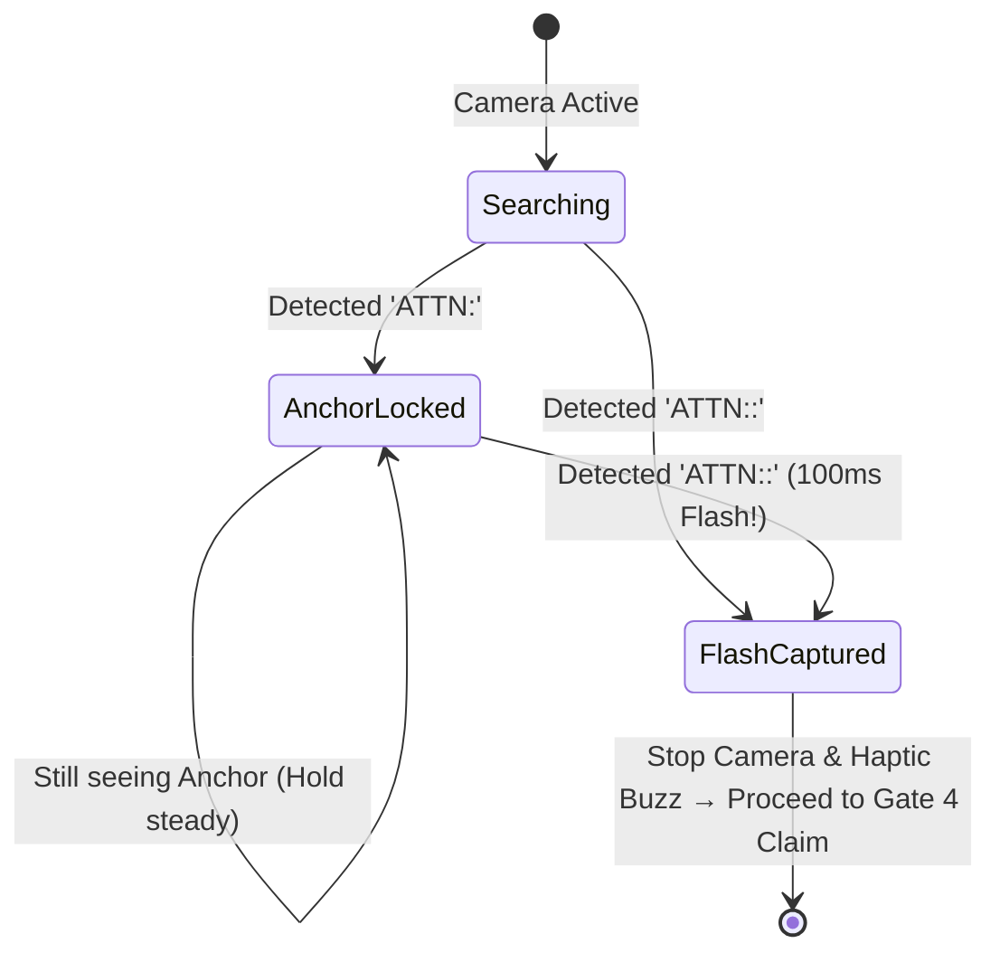

# 02 — Dual-State QR Optical Scanning Mechanism (Gate 3)

This is the most critical optical security component in AttendX. The mobile app must reliably lock onto the classroom projector and capture a sub-second rotating token flash while rejecting fraudulent static photos or delayed video streams.

---

## 1. The Dual-State Projector Protocol

The classroom projector screen (rendered by the Teacher Portal at `https://portal.atmyhome.tech`) switches between **two distinct visual states** every 3 seconds:

```text
┌─────────────────────────────────────────────────────────────┐
│                      3.0 Second Cycle                       │
├───────────────────────────────────────────────┬─────────────┤
│             Anchor Phase (2.9s)               │ Flash (0.1s)│
│                                               │             │
│ Payload: ATTN:<session_uuid>                  │ Payload:    │
│ Example: ATTN:550e8400-e29b-41d4-a716-446655440000          │ ATTN:<uuid> │
│                                               │ :<token>    │
│ Purpose: Mobile cameras locate QR, lock focus,│             │
│          adjust exposure, and lock session ID.│ Token Seal! │
└───────────────────────────────────────────────┴─────────────┘
```

### 1.1 State 1: Static Session Anchor (2.9 Seconds)
- **Format:** `ATTN:<session_uuid>`
- **Characteristics:**
  - Notice there is **NO second colon**!
  - 100% static throughout the entire lecture.
  - Does NOT contain a token.
  - Allows student phones in the back of the lecture hall to focus, adjust zoom/exposure, and "lock on".

### 1.2 State 2: Rotating Token Flash (0.1 Seconds / 100 ms)
- **Format:** `ATTN:<session_uuid>:<token_val>`
- **Characteristics:**
  - Contains the second colon, followed by a 4 to 8-character base62 rotating token (`a-z`, `A-Z`, `0-9`).
  - Minted in real-time by the backend metronome.
  - Visible for only **100 milliseconds**.

---

## 2. Why This Protocol Kills Streaming Attacks

If an absent student in their hostel asks a friend in the classroom to stream the projector over Discord, Zoom, or WhatsApp:
1. Video encoding codecs (H.264/H.265) run on 4:2:0 subsampling with keyframe buffering.
2. The 100 ms flash appears on the remote stream blurred or delayed by $300\text{ ms} - 1200\text{ ms}$.
3. By the time the remote student's phone decodes the stream and submits the claim, the server's verification latency judge calculates $\Delta > 250\text{ ms}$ and rejects the request with HTTP 412 `ERR_STREAM_DETECTED`.

---

## 3. Scanner State Machine

Your mobile scanner must operate as an autonomous continuous hunting loop:



1. **Searching**: User points phone at projector.
2. **Anchor Locked**: Camera detects `ATTN:<session_uuid>`. The UI changes border color to **Amber** and displays *"Session Locked! Hold steady for token flash..."*.
3. **Flash Captured**: Camera detects `ATTN:<session_uuid>:<token_val>`.
   - Vibrate device immediately (`HapticFeedback.mediumImpact()`).
   - Stop camera controller immediately.
   - Return `{ session_uuid, token_val }` to the claim controller.

---

## 4. Production Dart Implementation (`dual_state_scanner.dart`)

```dart
import 'dart:async';
import 'package:flutter/material.dart';
import 'package:flutter/services.dart';
import 'package:mobile_scanner/mobile_scanner.dart';
import 'package:permission_handler/permission_handler.dart';

class ScannedAttendanceToken {
  final String sessionUuid;
  final String tokenVal;

  const ScannedAttendanceToken({
    required this.sessionUuid,
    required this.tokenVal,
  });
}

class DualStateScannerPage extends StatefulWidget {
  const DualStateScannerPage({super.key});

  @override
  State<DualStateScannerPage> createState() => _DualStateScannerPageState();
}

class _DualStateScannerPageState extends State<DualStateScannerPage> with WidgetsBindingObserver {
  MobileScannerController? _controller;
  bool _hasPermission = false;
  bool _isCompleted = false;
  String? _lockedSessionUuid;
  bool _isTorchOn = false;

  @override
  void initState() {
    super.initState();
    WidgetsBinding.instance.addObserver(this);
    _requestCameraPermission();
  }

  Future<void> _requestCameraPermission() async {
    final status = await Permission.camera.request();
    if (!mounted) return;
    if (status.isGranted) {
      setState(() => _hasPermission = true);
      _initController();
    } else {
      setState(() => _hasPermission = false);
    }
  }

  void _initController() {
    _controller = MobileScannerController(
      detectionSpeed: DetectionSpeed.unrestricted, // HIGH SPEED: must not throttle frame processing!
      facing: CameraFacing.back,
      formats: const [BarcodeFormat.qrCode],
      returnImage: false,
    );
  }

  @override
  void didChangeAppLifecycleState(AppLifecycleState state) {
    if (_controller == null || _isCompleted) return;
    if (state == AppLifecycleState.paused) {
      _controller?.stop();
    } else if (state == AppLifecycleState.resumed) {
      _controller?.start();
    }
  }

  void _onDetect(BarcodeCapture capture) {
    if (_isCompleted) return;

    for (final barcode in capture.barcodes) {
      final raw = barcode.rawValue;
      if (raw == null || !raw.startsWith('ATTN:')) continue;

      final payload = raw.substring(5); // Strip 'ATTN:'
      final colonIndex = payload.indexOf(':');

      if (colonIndex == -1) {
        // STATE 1: ANCHOR DETECTED (ATTN:<session_uuid>)
        final sessionUuid = payload.trim();
        if (sessionUuid.length == 36) {
          if (_lockedSessionUuid != sessionUuid) {
            setState(() {
              _lockedSessionUuid = sessionUuid;
            });
            HapticFeedback.selectionClick();
          }
        }
      } else {
        // STATE 2: FLASH DETECTED (ATTN:<session_uuid>:<token_val>)
        final sessionUuid = payload.substring(0, colonIndex).trim();
        final tokenVal = payload.substring(colonIndex + 1).trim();

        if (sessionUuid.length == 36 && tokenVal.isNotEmpty) {
          // FLASH CAPTURED!
          _isCompleted = true;
          HapticFeedback.heavyImpact();
          _controller?.stop();

          Navigator.of(context).pop(
            ScannedAttendanceToken(
              sessionUuid: sessionUuid,
              tokenVal: tokenVal,
            ),
          );
          return;
        }
      }
    }
  }

  @override
  void dispose() {
    WidgetsBinding.instance.removeObserver(this);
    _controller?.dispose();
    super.dispose();
  }

  @override
  Widget build(BuildContext context) {
    if (!_hasPermission) {
      return Scaffold(
        backgroundColor: Colors.black,
        body: Center(
          child: Column(
            mainAxisSize: MainAxisSize.min,
            children: [
              const Icon(Icons.camera_alt_outlined, color: Colors.white54, size: 64),
              const SizedBox(height: 16),
              const Text(
                'Camera Permission Required',
                style: TextStyle(color: Colors.white, fontSize: 18, fontWeight: FontWeight.bold),
              ),
              const SizedBox(height: 8),
              const Text(
                'AttendX needs camera access to scan classroom projector QR codes.',
                textAlign: TextAlign.center,
                style: TextStyle(color: Colors.white70, fontSize: 14),
              ),
              const SizedBox(height: 24),
              ElevatedButton(
                onPressed: _requestCameraPermission,
                child: const Text('Grant Access'),
              )
            ],
          ),
        ),
      );
    }

    final isLocked = _lockedSessionUuid != null;

    return Scaffold(
      backgroundColor: Colors.black,
      appBar: AppBar(
        backgroundColor: Colors.black,
        title: const Text('Scan Projector QR', style: TextStyle(color: Colors.white)),
        actions: [
          IconButton(
            icon: Icon(_isTorchOn ? Icons.flash_on : Icons.flash_off, color: Colors.white),
            onPressed: () {
              _controller?.toggleTorch();
              setState(() => _isTorchOn = !_isTorchOn);
            },
          )
        ],
      ),
      body: Stack(
        children: [
          // Camera Stream
          if (_controller != null)
            MobileScanner(
              controller: _controller!,
              onDetect: _onDetect,
            ),

          // Reticle Viewport Overlay
          Center(
            child: Container(
              width: 280,
              height: 280,
              decoration: BoxDecoration(
                border: Border.all(
                  color: isLocked ? Colors.amberAccent : Colors.cyanAccent,
                  width: 3.5,
                ),
                borderRadius: BorderRadius.circular(16),
              ),
            ),
          ),

          // Dynamic Status Banner
          Positioned(
            bottom: 48,
            left: 24,
            right: 24,
            child: Container(
              padding: const EdgeInsets.symmetric(vertical: 14, horizontal: 18),
              decoration: BoxDecoration(
                color: isLocked ? Colors.amber.shade900.withOpacity(0.9) : Colors.black82,
                borderRadius: BorderRadius.circular(12),
                border: Border.all(
                  color: isLocked ? Colors.amberAccent : Colors.white24,
                ),
              ),
              child: Row(
                children: [
                  Icon(
                    isLocked ? Icons.lock_clock : Icons.filter_center_focus,
                    color: isLocked ? Colors.amberAccent : Colors.white70,
                    size: 28,
                  ),
                  const SizedBox(width: 14),
                  Expanded(
                    child: Column(
                      crossAxisAlignment: CrossAxisAlignment.start,
                      mainAxisSize: MainAxisSize.min,
                      children: [
                        Text(
                          isLocked ? 'SESSION LOCKED' : 'ALIGN WITH PROJECTOR',
                          style: TextStyle(
                            color: isLocked ? Colors.amberAccent : Colors.white,
                            fontSize: 13,
                            fontWeight: FontWeight.w900,
                            letterSpacing: 1.1,
                          ),
                        ),
                        const SizedBox(height: 2),
                        Text(
                          isLocked
                              ? 'Hold steady! Waiting for the 100ms rotating token flash…'
                              : 'Point camera at classroom projector screen',
                          style: const TextStyle(color: Colors.white70, fontSize: 12),
                        ),
                      ],
                    ),
                  )
                ],
              ),
            ),
          )
        ],
      ),
    );
  }
}
```
