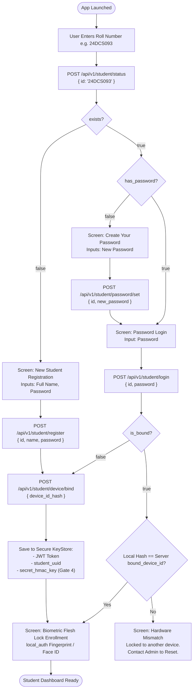

# 06 — Student Sign-In, Sign-Up & Device Onboarding Flow

This document details the complete end-to-end onboarding lifecycle for the AttendX student mobile app, from fresh installation to a fully bound and verified student device.

---

## 1. Roll Number Architecture & Parsing

In AttendX, student roll numbers follow a structured academic pattern:

$$\underbrace{\mathbf{24}}_{\text{Joining Year}} \quad \underbrace{\mathbf{D}}_{\text{College Code}} \quad \underbrace{\mathbf{CS}}_{\text{Branch Code}} \quad \underbrace{\mathbf{093}}_{\text{Student Index}}$$

| Segment | Meaning | Examples |
|---|---|---|
| **`24`** | Admission / Batch Year | `24` = 2024, `25` = 2025 |
| **`D`** | College Code | `D` = DEPSTAR, `C` = CSPIT, `BD` = BDPIAS |
| **`CS` / `CE`** | Branch / Department Code | `CS` = Computer Science, `CE` = Computer Engineering, `PH` = Pharmacy |
| **`093`** | Roll Number within Branch | `001` through `150` (maps to batches like `CE1`, `CE2`, `D2D`) |

**Deterministic Student Email:**
$$\text{Email} = \text{lowercase(roll\_no)} + \text{"@charusat.edu.in"}$$
*Example:* `24DCS093` $\rightarrow$ `24dcs093@charusat.edu.in`.

---

## 2. The Complete Onboarding Flowchart



---

## 3. Step-by-Step API Contract

### Step 1: Probe Student Status (`POST /api/v1/student/status`)
When the user types their roll number and clicks **Continue**:

```http
POST /api/v1/student/status
Host: api.atmyhome.tech
X-Api-Key: ag_live_xxxxxxxxxxxxxxxxxxxx
Content-Type: application/json

{
  "id": "24DCS093"
}
```

**Response (200 OK):**
```json
{
  "exists": true,
  "has_password": true,
  "is_bound": true
}
```

* Branch logic:
  - If `exists == false`: Route user to **Register Screen** (Step 2A).
  - If `exists == true && has_password == false`: Route user to **Set Password Screen** (Step 2B).
  - If `exists == true && has_password == true`: Route user to **Password Login Screen** (Step 2C).

---

### Step 2A: Self-Registration (`POST /api/v1/student/register`)
Used when a student enrolls for the first time:

```http
POST /api/v1/student/register
Host: api.atmyhome.tech
X-Api-Key: ag_live_xxxxxxxxxxxxxxxxxxxx
Content-Type: application/json

{
  "id": "24DCS093",
  "name": "Tirth Patel",
  "password": "SuperSecretPassword123"
}
```

**Response (201 Created):**
```json
{
  "student_uuid": "6fa85f64-5717-4562-b3fc-2c963f66afa6",
  "roll_no": "24DCS093",
  "email": "24dcs093@charusat.edu.in",
  "name": "Tirth Patel",
  "access_token": "eyJhbGciOiJIUzI1NiIsInR5cCI6IkpXVCJ9..."
}
```

---

### Step 2B: Set Password (`POST /api/v1/student/password/set`)
Used when an administrator pre-seeded the student without a password or cleared their password:

```http
POST /api/v1/student/password/set
Host: api.atmyhome.tech
X-Api-Key: ag_live_xxxxxxxxxxxxxxxxxxxx
Content-Type: application/json

{
  "id": "24DCS093",
  "new_password": "NewSecretPassword123"
}
```

**Response (200 OK):**
```json
{
  "success": true,
  "message": "Password set successfully"
}
```

---

### Step 2C: Standard Login (`POST /api/v1/student/login`)
Standard authentication for registered students:

```http
POST /api/v1/student/login
Host: api.atmyhome.tech
X-Api-Key: ag_live_xxxxxxxxxxxxxxxxxxxx
Content-Type: application/json

{
  "id": "24DCS093",
  "password": "SuperSecretPassword123"
}
```

**Response (200 OK):**
```json
{
  "success": true,
  "data": {
    "token": "eyJhbGciOiJIUzI1NiIsInR5cCI6IkpXVCJ9...",
    "student": {
      "student_uuid": "6fa85f64-5717-4562-b3fc-2c963f66afa6",
      "roll_no": "24DCS093",
      "name": "Tirth Patel",
      "bound_device_id": "e3b0c44298fc1c149afbf4c8996fb92427ae41e4649b934ca495991b7852b855"
    }
  }
}
```

---

### Step 3: Device Binding (`POST /api/v1/student/device/bind`)

> [!IMPORTANT]
> The server will only mint and return the **`secret_hmac_key`** during device binding! This key is the cryptographic seal used for Gate 4 attendance validation.

```http
POST /api/v1/student/device/bind
Host: api.atmyhome.tech
X-Api-Key: ag_live_xxxxxxxxxxxxxxxxxxxx
Authorization: Bearer <student_jwt>
Content-Type: application/json

{
  "device_id_hash": "e3b0c44298fc1c149afbf4c8996fb92427ae41e4649b934ca495991b7852b855"
}
```

**Response (200 OK):**
```json
{
  "bound": true,
  "student_uuid": "6fa85f64-5717-4562-b3fc-2c963f66afa6",
  "roll_no": "24DCS093",
  "secret_hmac_key": "4a7d3f8e02b1c69a5e8f1d4c7b2a9e0f3d6c9b2a5e8f1d4c7b2a9e0f3d6c9b2a"
}
```

**What the app must store in `flutter_secure_storage`:**
1. `attendx_jwt`: The JWT string.
2. `attendx_student_uuid`: `student_uuid`.
3. `attendx_roll_no`: `roll_no`.
4. `attendx_secret_hmac_key`: `secret_hmac_key` (64-char hex).
5. `attendx_hardware_uuid`: The raw UUIDv4 stored in KeyStore.

---

## 4. Hardware Mismatch Recovery Screen

If a student attempts to log in from a friend's phone or a new device after having already bound another phone:
1. `bound_device_id` on the server does NOT match `DeviceService.getDeviceIdHash()`.
2. The app **MUST NOT** proceed to the dashboard.
3. Show the **"Hardware Mismatch / Device Locked"** screen:
   - Icon: `Icons.phonelink_lock` (Amber/Red).
   - Heading: *"Device Mismatch Detected"*.
   - Description: *"Your account (24DCS093) is bound to another physical phone to prevent proxy attendance. If you have changed your phone, please visit your college department admin desk to request a hardware lock reset."*
   - CTA button: *"Sign Out / Back to Login"*.

---

## 5. Complete Dart Controller Implementation (`auth_controller.dart`)

```dart
import 'dart:convert';
import 'package:flutter/material.dart';
import 'package:http/http.dart' as http;
import '../services/device_service.dart';
import '../services/storage_service.dart';

enum AuthStep { enterRoll, register, setPassword, login, deviceLocked }

class AuthController extends ChangeNotifier {
  final String baseUrl;
  final String apiKey;

  AuthController({required this.baseUrl, required this.apiKey});

  AuthStep currentStep = AuthStep.enterRoll;
  String rollNo = '';
  bool isLoading = false;
  String? errorMessage;

  /// Step 1: Probe roll number status
  Future<void> probeRollNumber(String inputId) async {
    isLoading = true;
    errorMessage = null;
    notifyListeners();

    try {
      final res = await http.post(
        Uri.parse('$baseUrl/api/v1/student/status'),
        headers: {'X-Api-Key': apiKey, 'Content-Type': 'application/json'},
        body: jsonEncode({'id': inputId}),
      );

      final data = jsonDecode(res.body);
      rollNo = inputId.toUpperCase().trim();

      if (res.statusCode == 200) {
        final exists = data['exists'] == true;
        final hasPassword = data['has_password'] == true;

        if (!exists) {
          currentStep = AuthStep.register;
        } else if (!hasPassword) {
          currentStep = AuthStep.setPassword;
        } else {
          currentStep = AuthStep.login;
        }
      } else {
        errorMessage = data['error'] ?? 'Failed to verify roll number';
      }
    } catch (e) {
      errorMessage = 'Network error: Please check your connection';
    } finally {
      isLoading = false;
      notifyListeners();
    }
  }

  /// Step 2A: Self-register
  Future<bool> register({required String name, required String password}) async {
    isLoading = true;
    errorMessage = null;
    notifyListeners();

    try {
      final res = await http.post(
        Uri.parse('$baseUrl/api/v1/student/register'),
        headers: {'X-Api-Key': apiKey, 'Content-Type': 'application/json'},
        body: jsonEncode({'id': rollNo, 'name': name, 'password': password}),
      );

      final data = jsonDecode(res.body);
      if (res.statusCode == 201) {
        final token = data['access_token'];
        await _bindDeviceAndSave(token);
        return true;
      } else {
        errorMessage = data['error'] ?? 'Registration failed';
        return false;
      }
    } catch (e) {
      errorMessage = 'Network error: $e';
      return false;
    } finally {
      isLoading = false;
      notifyListeners();
    }
  }

  /// Step 2C: Login
  Future<bool> login({required String password}) async {
    isLoading = true;
    errorMessage = null;
    notifyListeners();

    try {
      final res = await http.post(
        Uri.parse('$baseUrl/api/v1/student/login'),
        headers: {'X-Api-Key': apiKey, 'Content-Type': 'application/json'},
        body: jsonEncode({'id': rollNo, 'password': password}),
      );

      final data = jsonDecode(res.body);
      if (res.statusCode == 200) {
        final token = data['data']['token'];
        final student = data['data']['student'];
        final boundDeviceId = student['bound_device_id'];
        final localHash = await DeviceService.getDeviceIdHash();

        if (boundDeviceId == null) {
          // First time binding
          await _bindDeviceAndSave(token);
          return true;
        } else if (boundDeviceId != localHash) {
          // Hardware mismatch
          currentStep = AuthStep.deviceLocked;
          notifyListeners();
          return false;
        } else {
          // Valid bound device login
          await StorageService.saveJwt(token);
          await StorageService.saveStudentUuid(student['student_uuid']);
          await StorageService.saveRollNo(rollNo);
          return true;
        }
      } else {
        errorMessage = data['error'] ?? 'Incorrect password';
        return false;
      }
    } catch (e) {
      errorMessage = 'Network error: $e';
      return false;
    } finally {
      isLoading = false;
      notifyListeners();
    }
  }

  /// Binds hardware hash and securely persists HMAC key
  Future<void> _bindDeviceAndSave(String token) async {
    final localHash = await DeviceService.getDeviceIdHash();
    final res = await http.post(
      Uri.parse('$baseUrl/api/v1/student/device/bind'),
      headers: {
        'X-Api-Key': apiKey,
        'Authorization': 'Bearer $token',
        'Content-Type': 'application/json',
      },
      body: jsonEncode({'device_id_hash': localHash}),
    );

    final data = jsonDecode(res.body);
    if (res.statusCode == 200) {
      await StorageService.saveJwt(token);
      await StorageService.saveStudentUuid(data['student_uuid']);
      await StorageService.saveRollNo(data['roll_no']);
      await StorageService.saveHmacKey(data['secret_hmac_key']);
    } else {
      throw Exception(data['error'] ?? 'Device binding failed');
    }
  }
}
```
